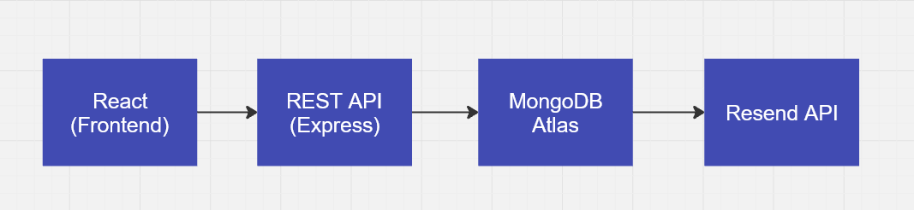
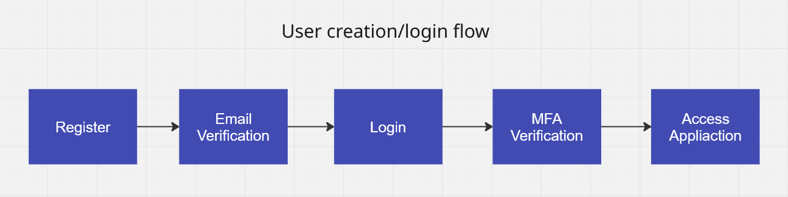
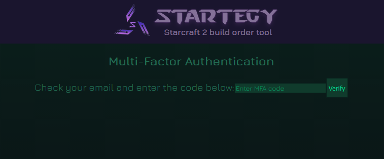
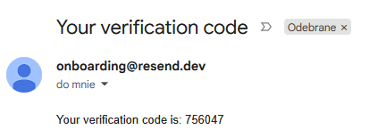
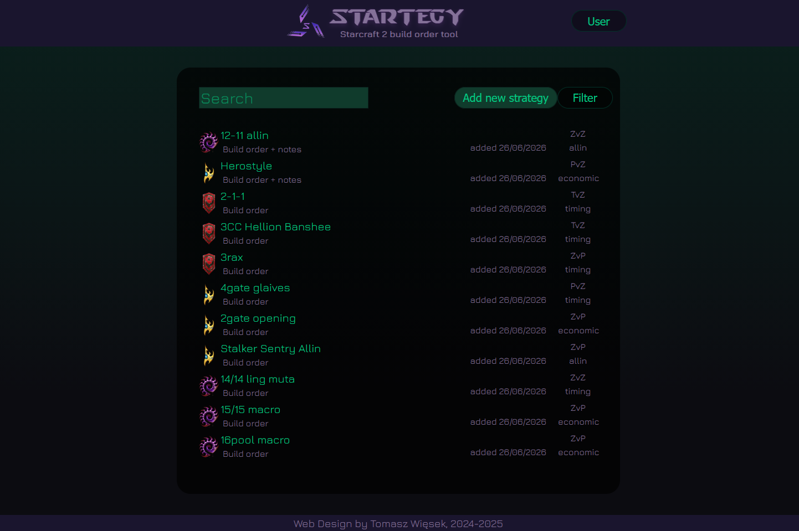
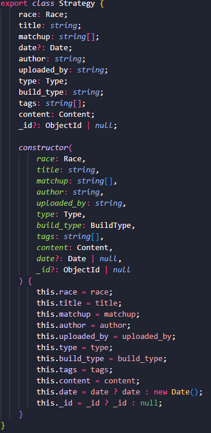

# StarTegy
---
## Overview

StarTegy is a full-stack web application designed for creating, managing and sharing StarCraft II strategies and build orders.

The project was built to simulate a production-style web application rather than a simple CRUD project. It implements a complete authentication workflow including email verification, password reset and multi-factor authentication (MFA), together with a REST API, secure session handling and a structured MongoDB backend.

The application allows users to create detailed strategy guides containing build orders, matchup-specific information and additional notes while providing search and filtering capabilities for discovering existing strategies.

---
## Tech Stack

**Frontend:**
- React
- TypeScript
- Vite
- React Router
- CSS

**Backend:**
- Node.js
- Express
- TypeScript
- REST API

**Database:**
MongoDB Atlas

**Authentication & Security:**
- JWT Authentication
- HttpOnly Cookies
- Email Verification
- Email-based Multi-Factor Authentication (MFA)
- Password Reset Workflow
- Rate Limiting

**External Services:**
- Resend API

**Development Tools:**
- Nodemon
- dotenv

---
## Features

**User Authentication:**
- User registration
- Secure login
- JWT-based authentication
- HttpOnly cookie sessions
- Email verification
- Email-based multi-factor authentication (MFA)
- Password reset via email
- Protected API endpoints

**Strategy Management:**
- Create strategy guides
- Edit existing strategies
- Delete strategies
- Browse all published strategies
- Detailed strategy pages
- Structured build order editor
- Matchup-specific strategy information
- Strategy notes

**Search & Discovery:**
- Search strategies
- Filter by race
- Filter by matchup
- Filter by additional strategy properties

**Backend:**
- RESTful API
- MongoDB integration
- Environment-based configuration
- External email service integration
- Request rate limiting for authentication endpoints

---

## Setup & Installation

### 1. Clone repository
```
git clone https://github.com/murasame112/StarTegy.git
cd StarTegy/src
```
### 2. Environment variables
Create `.env` file in `src/backend`:

```
MONGO_CONNECTION_STRING=
JWT_SECRET=
VERIFICATION_SECRET=
RESET_PASSWORD_SECRET=
RESEND_API_KEY=
EMAIL_DOMAIN=
```
### 3. Install dependencies and run project

```
npm run install:all
npm run dev
```

---
## Architecture
The project follows a separated frontend/backend architecture.



- React frontend communicates with the backend through a REST API.
- Express handles authentication, business logic and data validation.
- MongoDB Atlas stores users and strategy data.
- Sensitive configuration is managed using environment variables.
- Authentication is implemented using JWT stored in HttpOnly cookies.
- Email verification, password reset and MFA are integrated using the Resend email service.

---

## Screenshots








---
## Engineering Highlights  
- Designed a complete authentication flow including email verification, MFA and password recovery.  
- Integrated external email services using Resend.  
- Implemented secure authentication using JWT and HttpOnly cookies.  
- Built a REST API consumed by a separate React frontend.  
- Structured application into separate frontend and backend projects.

---
## Author

Built by Tomasz Więsek
